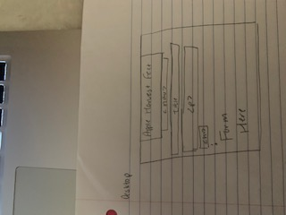
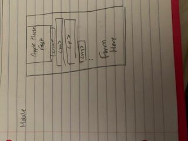
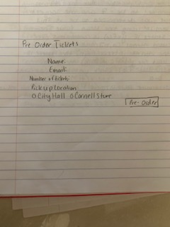
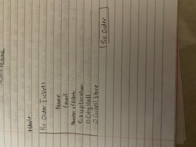
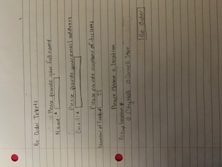
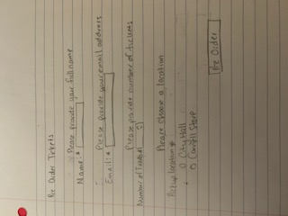

# Project 3: Design Journey

**For milestones, complete only the sections that are labeled with that milestone.**

Be clear and concise in your writing. Bullets points are encouraged.

**Everything, including images, must be visible in Markdown Preview.** If it's not visible in Markdown Preview, then we won't grade it. We won't give you partial credit either.

**Make the case for your decisions using concepts from class, as well as other design principles, theories, examples, and cases from outside of class.**

You can use bullet points and lists, or full paragraphs, or a combination, whichever is appropriate. The writing should be solid draft quality but doesn't have to be fancy.

## Project 1 or Project 2
> Which project will you add a form to?

I will be adding form to project 2.


## Audience (Milestone 1)
> Who is your site's target audience? This should be the original audience from Project 1 or Project 2. You may adjust the audience if necessary. Just make sure you explain your rationale for doing so here.

My target audience is Cornell students and locals who haven't attended the Apple Harvest Fest yet.


## Audience's Needs (Milestone 1)
> List the audience's needs that you identified in Project 1 or 2. Just list each need. No need to include the "Design Ideas and Choices", etc. You may adjust the needs if necessary. However, any changes you make to the needs for this project should be clearly identified and justified.

- Information about the event (the duration, where the event is)
- How much does it cost
- Information about parking and transportation


## HTML Form + User Needs Brainstorming (Milestone 1)
> Using the audience needs you identified, brainstorm possible options for an HTML form for the site. List each idea and provide a brief rationale for how the HTML form addresses that need.

- Information about the event - I can use an HTML form to ask the user if they want any additonal information or updates on the even and ask for their email address. This HTML form would highlight that an email is required if they do in fact want more information on the event.
- The cost of the event- I would use an HTML form on the section where the users would order tickets for the event. All parts of this form would be required that includes name, pickup location, email address, and the number of tickets. This is all essential information needed to complete the process of purchasing tickets if the user keeps a portion blank a message will pop up not explaining what needs to be filled out before the form can properly be submitted.
- Information about parking and Transportation - An HTML form can possibly be made to purchasse parking passes for the event.


## HTML Form Proposal & Rationale (Milestone 1)
> Make a decision about your site's form. Describe the purpose of your proposed form for your Project 1 or 2 site. Provide a brief rationale explaining how your proposed form meets the needs of your site's audience.
> Note: If your form is a contact form, we expect to see a thorough justification explaining how a contact form addresses the user's _actual_ needs. In your justification explain how a contact form better suits the needs of your user compared to the alternatives (e.g. sending you an email using your email address).

Form Proposal: Purchasing tickets for the apple harvest festival

User Needs Rational: This form provides the cost of the tickets and it will allow the user to purchase the tickets for to attend this event. It also gives essential information regarding the pickup location and will provide us with the users email so we can email them a receipt of the ticket. Different form would ask the user for just their email just in case they want additional information and updates regarding this event.


## Form User Data (Milestone 1)
> Think through and plan the data you need to collect from the users. Do you need their name? Email address? etc.

- Name
- email address
- Pickup Location
- number of tickets


## Form Components & Validation Criteria (Milestone 1)
> For each piece of data you plan to collect from the users, identify an appropriate HTML component to collect that data and decide the validation criteria (e.g. whether this data is _required_). Briefly explain your reasoning for the component choice and the validation criteria.

- TODO
- Name (required): text field; `<input type="text">`
    - Email address (required): text;`<input type='email'>`
- Pickup location(required):text; `<input type='text'>`
- Number of Tickets(required):number; `<input type='number'>`


## Form Location (Milestone 1)
> Which HTML file will you place your form?

-index.html


> Sketch the location of the form in that page. This sketch need not be fancy. You don't need to provide many details of the page or form. Just plan the location of the form on the page and communicate that to us. You can literally have a box that says "FORM HERE."

**Desktop Location**




**Mobile Location**





## Form Design (Milestone 1)
> Include sketches on your form below. Include sketches of your **mobile and desktop** versions without corrective feedback. Show us the evolution of your design and the alternatives you considered.

**Desktop Sketches**




**Mobile Sketches**




## Form Feedback Design (Milestone 1)
> Include sketches of your **mobile and desktop** with _corrective feedback_. Show us the evolution of your design and the alternatives you considered.

**Desktop Feedback**





**Mobile Feedback**





## Form Implementation Planning (Milestone 1)
> What submission method will your form use? GET or POST. Explain your reasoning.

For this form I will be using the POST method. This is because I think the information given is personal information from the user.

> For your site's `<form>` element, plan all HTML attributes that you will need and their values. Hint: action=, method=, novalidate

`<form action="https://www.cs.cornell.edu/courses/cs1300/2020fa/submit.php" method="post" novalidate/>`

-`<input type="text">`
-`<input type='email'>`
-`<input type='number'>`

## Additional Information (Milestone 1)
> (optional) Include any additional information, justifications, or comments we should be aware of.

TODO


## Plan Validation Pseudocode (Final Submission)
> Write your form validation pseudocode here.

```
When user submits form "On Form Submit snippet"

if name is valid ("check validity" snippet)
hide name feedback
else
show name feedback

if email is valid ("check component validilty" snippet)
hide email feedback
else
show feedback

if numtickets component is valid ("check component validity" snippet)
hide tickets feedback
else
show tickets feedback
if the validility is fine send form to server submit snippet


```


## Additional Design Justifications (Final Submission)
> If you feel like you haven’t fully explained your design choices in the final submission, or you want to explain some functions in your site (e.g., if you feel like you make a special design choice which might not meet the final requirement), you can use the additional design justifications to justify your design choices. Remember, this is place for you to justify your design choices which you haven’t covered in the design journey. Use it wisely. However, you don’t need to fill out this section if you think all design choices have been well explained in the final submission design journey.

TODO


## Self-Reflection (Final Submission)
> This was the first project in this class where you coded some JavaScript. What did you learn from this experience?

TODO


> Reflect on how HTML, CSS, and JavaScript together support client-side interactivity. If it's helpful, you can describe your mental model of client-side interactivity or explain how the general idea of showing and hiding content can be used to implement other forms of client-side interactivity beyond form validation and feedback.

TODO


> Take some time here to reflect on how much you've learned since you started this class. It's often easy to ignore our own progress. Take a moment and think about your accomplishments in this class. Hopefully you'll recognize that you've accomplished a lot and that you should be very proud of those accomplishments!

TODO
